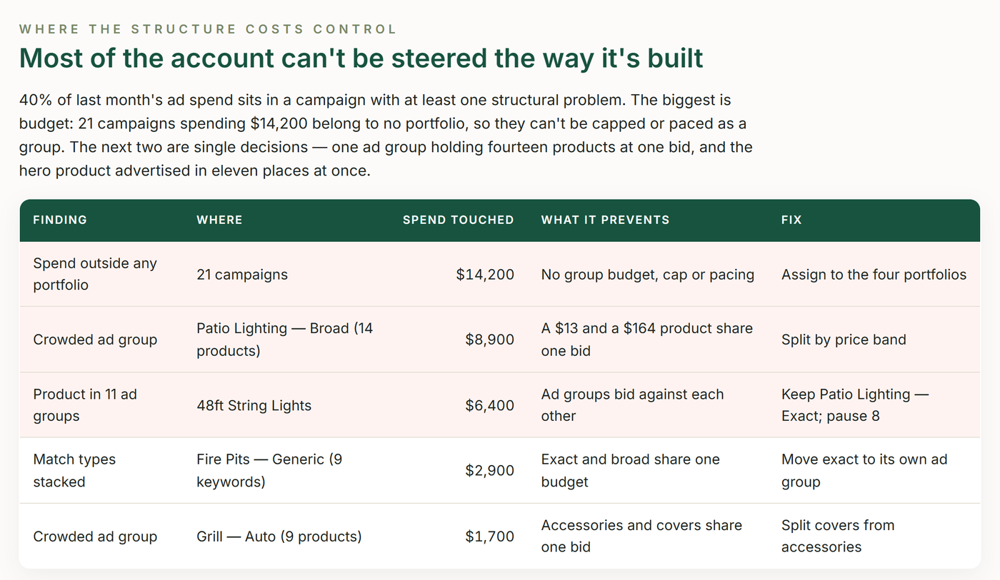

# TrackIQ: Amazon Sponsored Ads Structure Audit

Checks the shape of a Sponsored Ads account — how campaigns, ad groups, keywords and products are arranged — and ranks every structural problem by the spend it touches.

Run it when taking over an account, before a restructure, and once a quarter.

Part of **Amazon Sponsored Ads** in the
[TrackIQ skills catalog](https://github.com/TrackIQ-HQ/amazon-seller-skills).

Built as an [Agent Skill](https://code.claude.com/docs/en/skills). Runs in
Claude Code, Claude web, Claude desktop and ChatGPT from the same folder.

---

## Powered by the TrackIQ MCP

[](https://trackiq.com/mcp)

This skill reads your live Amazon account through the
**[TrackIQ MCP](https://trackiq.com/mcp)** — 16 tools connecting your AI
assistant to Amazon data:

Sales & Traffic · Orders · Inventory · Returns · Sponsored Products · Sponsored
Brands · Sponsored Display · Amazon DSP · AMC Cloud · Keywords · Search Terms ·
Targeting · Search Query Performance · Organic Rank · Best Seller Rank · Buy Box
History · Brand Analytics · Export

Works with Claude, ChatGPT and Cursor. **[Get access →](https://trackiq.com/mcp)**

---

## What you get



Audits how an Amazon Sponsored Ads account is built rather than how it performed last week — ad groups crowded with unrelated products, the same product advertised in a dozen ad groups competing with itself, keywords stacked in every match type inside one ad group, spend sitting outside any portfolio, and selling products with no ad at all — ranked by the spend each problem touches, with a fix order the team can work through. Use when the user asks for an account structure audit, campaign structure review, PPC account audit, restructure plan, account cleanup, portfolio setup, ad group hygiene, cannibalization between ad groups, or which products are not advertised.

### The rules that keep it honest

- **Rank findings by the spend they touch, never by count**
- **Judge structure on enabled entities only**
- **Never recommend restructuring something that is working just to make it tidy**
- **Portfolio coverage is arithmetic, not a join**

The full list is in `SKILL.md`, and each one exists because getting it wrong
produces a confident, wrong answer rather than an obvious error.

## Requirements

- The TrackIQ MCP, for `list_marketplaces`, `get_campaigns`, `get_ad_groups`, `get_targets`, `get_product_ads`, `get_portfolios` and `get_product_performance`. - Nothing else. No filesystem or internet needed. - **Without the MCP:** works from a Sponsored Products bulk file exported from Campaign Manager plus a business report by ASIN.

---

## Install

### Claude Code

```
/plugin marketplace add TrackIQ-HQ/amazon-seller-skills
/plugin install trackiq-amazon-campaign-structure-audit@trackiq
```

### Claude web, desktop, mobile

1. Download the `.zip` from the
   [latest release](https://github.com/TrackIQ-HQ/trackiq-amazon-campaign-structure-audit/releases)
2. **Settings → Capabilities → Skills** (code execution must be on)
3. **Create skill → Upload a skill**, choose the `.zip`
4. Toggle it on

### ChatGPT

Same zip. **Plugins → Skills → Create → Upload from your computer.**

---

## Setup

Answers live in `account.md`, copied from
[`assets/account.example.md`](skills/trackiq-amazon-campaign-structure-audit/assets/account.example.md).
**Every TrackIQ skill reads the same file**, so an account already set up for
another TrackIQ report needs nothing added.

## Delivery

Asked once and stored in `account.md`: **in-chat** (default), **file**,
**Slack**, **n8n** or **email**. Anything leaving the chat confirms with you
first and falls back to in-chat, with a note.

---

## Customizing

| File | What it controls |
|---|---|
| `checks.md` | the pre-send checks |
| `method.md` | the method and every threshold |
| `pulls.md` | the call sequence and its traps |
| `report-template.html` | the report shell |

---

## Contributing

```bash
python scripts/validate.py    # must exit 0 before any commit
python scripts/build.py       # writes dist/ zip + registry.json
```

Read [AUTHORING.md](https://github.com/TrackIQ-HQ/amazon-seller-skills/blob/main/AUTHORING.md)
before proposing changes.

## License

MIT. See [LICENSE](LICENSE).
